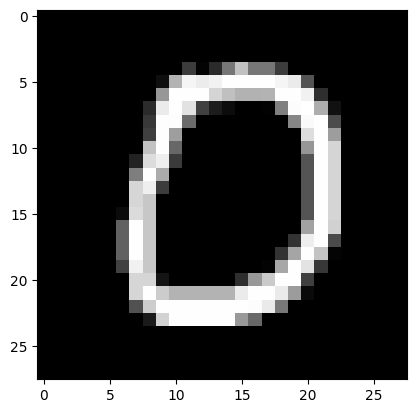

# Handwritten Digit Recognition using PyTorch

This Jupyter Notebook demonstrates the process of training and evaluating a machine learning model. The model is trained on a dataset and evaluated for its performance on a test set. 

## Requirements

To run this notebook, you need the following dependencies:
- Python 3.x
- torch
- torchvision
- matplotlib

You can install these dependencies using pip:

```bash
pip install torch torchvision matplotlib

```

## Notebook Contents
1. Setup: Import necessary libraries and set up device configuration.
2. Data Loading: Load and preprocess the dataset.
3. Model Definition: Define the neural network architecture.
4. Training: Train the model with the training dataset.
5. Evaluation: Evaluate the model's performance on the test dataset.
6. Visualization: Visualize some predictions made by the model.


## Testing

For testing purposes you can manipulate the code below to observe if the number shown is correct to the model's prediction.

```python
data, target = test_data[10]

data = data.unsqueeze(0).to(device)

output = model(data)

prediction = output.argmax(dim = 1, keepdim = True).item()

print('Prediction: {:.4f}'.format(prediction))

image = data.squeeze(0).squeeze(0).cpu().numpy()

plt.imshow(image, cmap = 'gray')

plt.show()

```

Each index in the array test_data represents an image with a number. For instance, in this example the index is 10, which represents this image:



The following image is processed to the model's prediction and prints the corresponding result:

```
Prediction: 0.0000
```